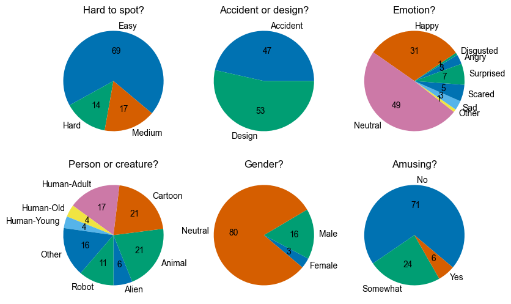
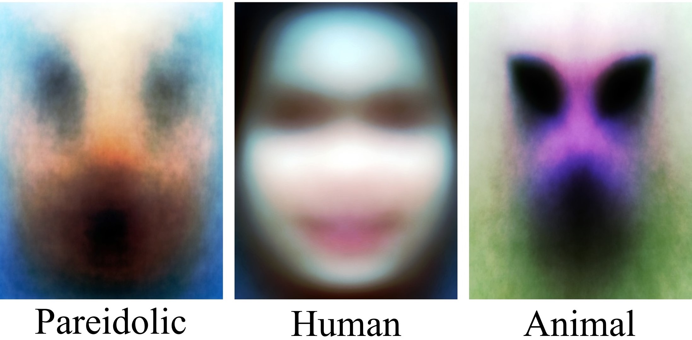

# Seeing Faces in Things: A Model and Dataset for Pareidolia

[](https://aka.ms/facesinthings) [](https://arxiv.org/abs/2403.10516) [](https://colab.research.google.com/github/mhamilton723/FacesInThings/blob/main/Demo%20Usage.ipynb)

[//]: # ([![Huggingface]&#40;https://img.shields.io/badge/%F0%9F%A4%97%20Hugging%20Face-FeatUp-orange&#41;]&#40;https://huggingface.co/spaces/mhamilton723/FeatUp&#41; )
[//]: # ([![Huggingface]&#40;https://img.shields.io/badge/%F0%9F%A4%97%20Hugging%20Face-Paper%20Page-orange&#41;]&#40;https://huggingface.co/papers/2403.10516&#41;)
[//]: # ([![PWC]&#40;https://img.shields.io/endpoint.svg?url=https://paperswithcode.com/badge/featup-a-model-agnostic-framework-for/feature-upsampling-on-imagenet&#41;]&#40;https://paperswithcode.com/sota/feature-upsampling-on-imagenet?p=featup-a-model-agnostic-framework-for&#41;)


[Mark Hamilton](https://mhamilton.net/),
[Simon Stent](https://scholar.google.com/citations?user=f3aij5UAAAAJ&hl=en)
[Vasha DuTell](https://vashadutell.com/)
[Anne Harrington](https://persci.mit.edu/people/anne)
[Jennifer Corbett](https://persci.mit.edu/people/jennifercorbett/)
[Ruth Rosenholtz](https://persci.mit.edu/people/rosenholtz)
[William T. Freeman](https://billf.mit.edu/about/bio)


*TL;DR*:We introduce a dataset of over *5000 human annotated pareidolic images*. We also link pareidolia in algorithms to the process of learning to detect animal faces.


We introduce an annotated dataset of five thousand human labeled pareidolic face images, called ``Faces in Things''. Faces in Things is derived from the LAION-5B dataset and annotated for key face attributes and bounding boxes



We show the average face computed from the FacesInThings, WIDER FACE, and Animal Web Datasets Respectively:




## Installation

Clone the repository:

```bash
pip install facesinthings
```

```bash
git clone https://github.com/mhamilton723/FacesInThings.git
```

Install the required Python dependencies:

```
pip install -r requirements.txt
```

## Usage
The dataset is downloaded automatically if not available locally.

See our [Demo Usage Notebook](Demo%20Usage.ipynb) for some quick examples of working with the dataset

## Dataset Structure

```
FacesInThings.zip
│
├── images/
│   ├── 000000009.jpg
│   ├── 000000027.jpg
│   ├── ...
│
└── metadata.csv
```

The `metadata.csv` file contains the following fields:

- `file`: Name of the image file.
- `url`: Direct URL to the image.
- `boxes`: Bounding boxes for the detected pareidolic faces. Stored in `[x1, y1, w, h]` format
- `is_primary`: Whether the bounding box is the primary face.
- `Is there a face?`: Yes/No/Several.
- `Hard to spot?`: Difficulty in spotting the face (Easy/Medium/Hard).
- `Accident or design?`: Whether the face appears accidental or by design.
- `Emotion?`: Perceived emotion (Neutral, Happy, Sad, etc.).
- `Person or creature?`: Type of face (Human, Animal, Alien, etc.).
- `Gender?`: Perceived gender (Neutral, Female, Male).
- `Amusing?`: Whether the face is amusing (Yes/No/Somewhat).
- `Common?:` How common this type of pareidolia is.
- `Flags`: Any additional flags (e.g., ‘Interesting’, ‘NSFW’).
- `num_boxes`: Number of bounding boxes.
- `train`: Whether the image is part of the training split.


## Citation
```
@inproceedings{hamilton2024seeing,
  title={Seeing Faces in Things: A Model and Dataset for Pareidolia},
  author={Hamilton, Mark and Stent, Simon and others},
  booktitle={ECCV},
  year={2024}
}
```

